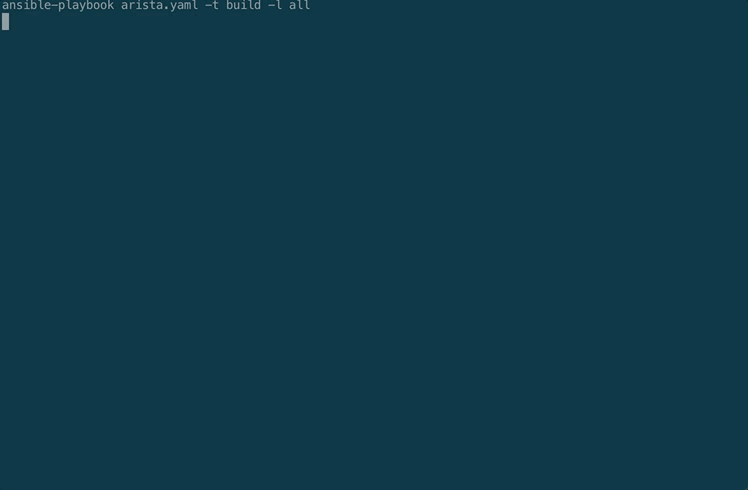

# Arista Networks using Ansible and Docker

Build, check and deploy configuration to Arista Networks switches using Ansible and cEOS on Docker 

###### Usage:
Build config:
```
# make arista-build
```
Diff against running:
```
# make arista-diff
```

Deploy config
```
# make arista-deploy
```
###### Example:


